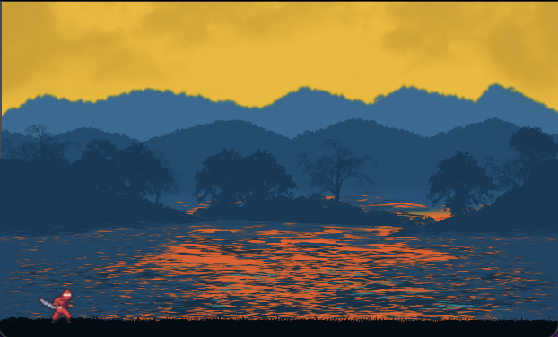

# Ninja Fighters 🥷

Welcome to Ninja Platformer 2D, a captivating 2D platformer that draws you into a world of ninjas, mystery, and adventure. Crafted using the powerful Godot engine and .NET, the game offers an immersive experience that both challenges and delights.

## Overview

* **Game Engine:** Developed using the Godot engine.
* **Scripting:** Utilizes .NET (might get some F# in too).
* **Design Inspiration:** Game design envisioned by my talented 4th grade daughter.
* **Assets:** Aesthetic game assets carefully curated from skilled artisans on itch.io.

## Features

* **Exciting Gameplay:** Embark on a journey through engaging levels filled with challenges, obstacles, and enemies.
* **Creative Design:** Unique level design and artistic touch inspired by a 4th-grader's creativity.
* **Artisan Assets:** Enjoy beautiful visuals and soundscapes acquired from talented creators on itch.io.
* **Ninja Skills:** Master ninja techniques to overcome challenges and conquer your foes.

## Getting Started

### Requirements

- Godot Engine 4
- .NET 6

### Installation

1. Clone the repository 
2. Open the project in Godot.
3. Dive into the world of ninjas!

## Credits

- **Game Design:** Ava
- **Scripting & Development:** bentok
- **Assets:** Acquired from talented creators on itch.io (credits in the final product).

## License

All rights reserved.

**Happy gaming and enjoy the adventure! 🎮**
